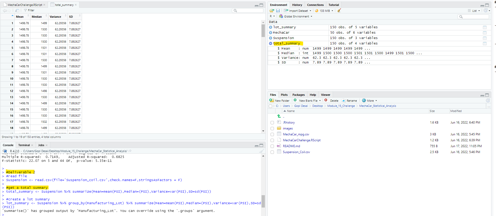
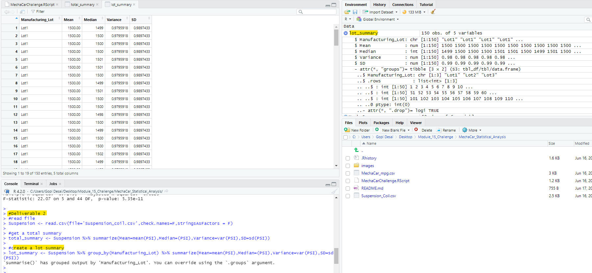
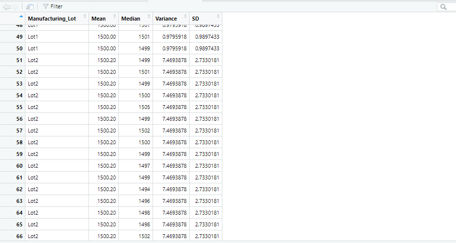
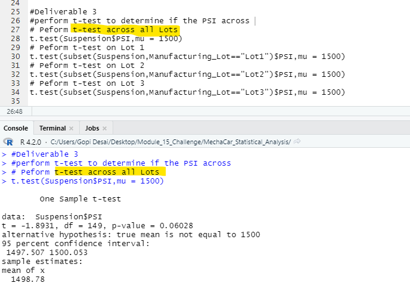
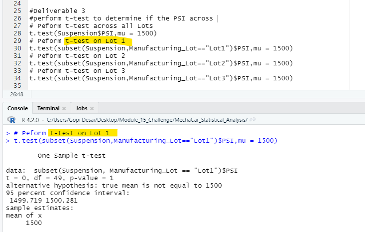
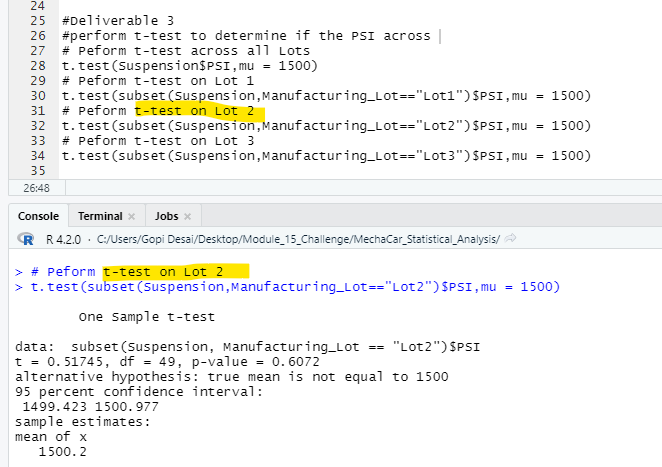
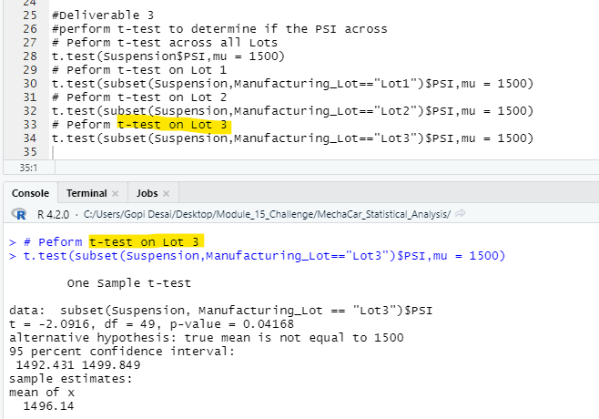

# MechaCar_Statistical_Analysis

## Linear Regression to Predict MPG
* Which variables/coefficients provided a non-random amount of variance to the mpg values in the dataset? 
  
  Ground clearance and vehicle length had the highest random variation.

* Is the slope of the linear model considered to be zero? Why or why not? 
  
  Our slope is not zero just be looking at the p-value, which is less than 0.05.

* Does this linear model predict mpg of MechaCar prototypes effectively? Why or why not? 

  Our R-squared value is 71%, which means roughly ~71% of the time the model will predict mpg values correctly. There are probably other factors that were not captured in the datasaet that contribute to the mpg variability of the MechaCar prototypes.

## Summary Statistics on Suspension Coils,
* The design specifications for the MechaCar suspension coils dictate that the variance of the suspension coils must not exceed 100 pounds per square inch. Does the current manufacturing data meet this design specification for all manufacturing lots in total and each lot individually? Why or why not?

   Lot 1 and Lot 2 are both within design specifications and have nearly the same exact mean and median. Lot 3 shows the most variance and exceeds the manufacturers specs.

## T-Tests on Suspension Coils

* All t-tests can be seen below: 

## Across all lots:

## Lot 1:

## Lot 2:

## Lot 3:

## Study Design: MechaCar vs Competition
When comparing MechaCar to its competitor’s other metrics that could be of interest to a consumer could include cost, car color, city fuel efficiency, highway fuel efficiency, horsepower, maintenance cost, or safety rating.

* What metric or metrics are you going to test?    
The next metrics to test should be the safety rating, horsepower, and highway fuel efficiency, which address some safety concerns of consumers.  

* What is the null hypothesis or alternative hypothesis?     
The null hypothesis is that the mean of the safety rating is zero. The alternative hypothesis is that the mean of the safety rating is not zero. 

* What statistical test would you use to test the hypothesis? And why?      
Using a multiple linear regression statistical summary would show how the variables impact the safety ratings for MechaCar and their competitors. 

* What data is needed to run the statistical test?      
A random sample of n > 30 for MechaCar and their competitor, would need to be collected including the safety ratings, highway fuel efficiency, and horsepower plus running the data through RStudio. 